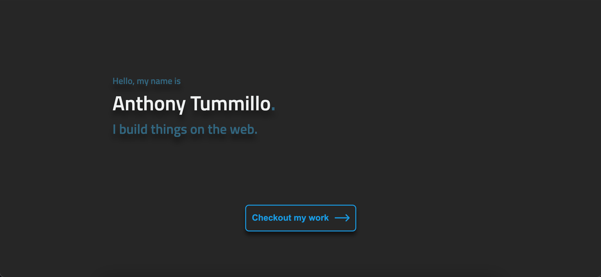

# My Portfolio Site



> My personal website and portfolio!

---
### Table of Contents

- [My Portfolio Site](#my-portfolio-site)
    - [Table of Contents](#table-of-contents)
  - [Description](#description)
      - [Technologies](#technologies)
  - [How To Use](#how-to-use)
    - [Installation](#installation)
  - [License](#license)
  - [Author Info](#author-info)

---

## Description

This is my first 100% custom built, "farm to table" project. It is serving as both my own personally branded website and online portfolio. I am the sole contributor from design through to the latest live version. Some of my favorite aspects of this site are the mouse tracking animation at the beginning as well as the various interactive elements throughout the page. 

#### Technologies

- Javascript (ES6)
- HTML5
- Sass/CSS3
- Webpack
- Django
- Docker

[Back To The Top](#my-portfolio-site)

---

## How To Use

It can be viewed live at [anthonytummillo.com](https://anthonytummillo.com)

### Installation

```unix
    git clone https://github.com/ATummillo/portfolio-site.git
    cd portfolio-site
    docker-compose up
```
The site should now be running at [localhost:8000](http://localhost:8000)

[Back To The Top](#my-portfolio-site)

---

---

## License

MIT License

Copyright (c) [2021] [Anthony Tummillo]

Permission is hereby granted, free of charge, to any person obtaining a copy
of this software and associated documentation files (the "Software"), to deal
in the Software without restriction, including without limitation the rights
to use, copy, modify, merge, publish, distribute, sublicense, and/or sell
copies of the Software, and to permit persons to whom the Software is
furnished to do so, subject to the following conditions:

The above copyright notice and this permission notice shall be included in all
copies or substantial portions of the Software.

THE SOFTWARE IS PROVIDED "AS IS", WITHOUT WARRANTY OF ANY KIND, EXPRESS OR
IMPLIED, INCLUDING BUT NOT LIMITED TO THE WARRANTIES OF MERCHANTABILITY,
FITNESS FOR A PARTICULAR PURPOSE AND NONINFRINGEMENT. IN NO EVENT SHALL THE
AUTHORS OR COPYRIGHT HOLDERS BE LIABLE FOR ANY CLAIM, DAMAGES OR OTHER
LIABILITY, WHETHER IN AN ACTION OF CONTRACT, TORT OR OTHERWISE, ARISING FROM,
OUT OF OR IN CONNECTION WITH THE SOFTWARE OR THE USE OR OTHER DEALINGS IN THE
SOFTWARE.

[Back To The Top](#my-portfolio-site)

---

## Author Info

- Personal Website - [anthonytummillo.com](https://anthonytummillo.com)
- Codepen - [codepen.io/ATummillo](https://codepen.io/ATummillo/)
- LinkedIn - [linkedin.com/in/anthonytummillo](https://www.linkedin.com/in/anthonytummillo/)
- Email - atummillo.dev@gmail.com

[Back To The Top](#my-portfolio-site)
